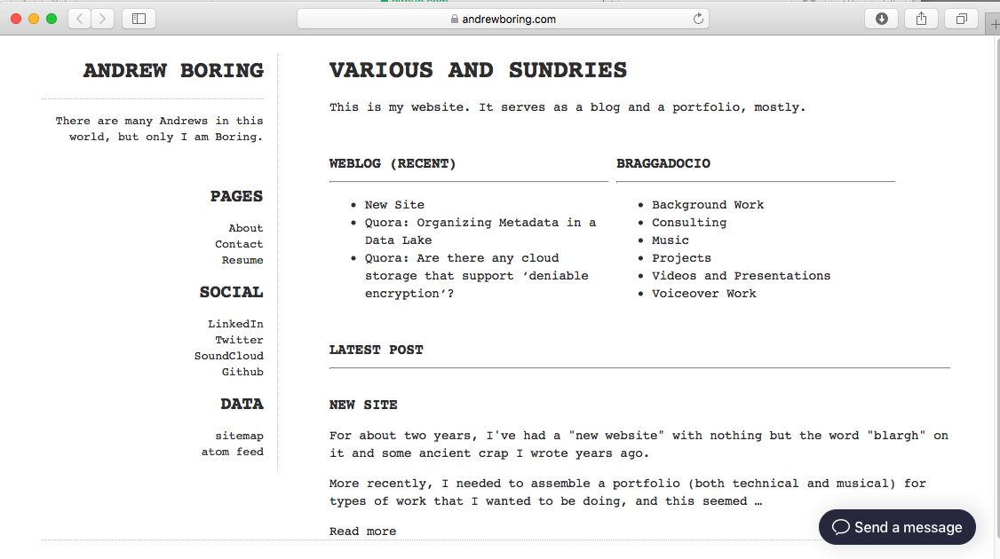

Monospace - Andrew Boring
==========

This theme was modified from [Monospace for Pelican](https://github.com/getpelican/pelican-themes/tree/master/monospace), which in turn was adapted from [Monospace for Wordpress](http://wordpress.org/themes/monospace).

It is used for my [personal website](https://andrewboring.com).

It features a static home page template, with content organized around a flat hierarchy and features selected content for front page display.

There is a top-sticky "back" link on each page and article. The assumption is flat content, so there is never a need for a hierarchical menu and breadcrumb system.

Screenshot:



To use the home page, add the following to your Pelican settings:
```
INDEX_SAVE_AS = '/blog/index.html'
```

This tells Pelican that we want our default Blog index file to be saved in the /blog folder with the rest of our content.

Create a Home.md Page (not article) with the following Metadata:

```
Title: Various and Sundries
save_as: index.html
slug: index
status: hidden
Home: yes
Template: home
```

The save_as directs it to save the home page as the the root index.html file.  
The slug is 'index', naturally.   
"Status: hidden" hides this page from the Pages menu, if DISPLAY_PAGES_ON_MENU = True (default).
I added the "Home: yes" for the top-stick "back" button to display on pages not marked as "Home".
And Template: home specifies to use the home.html template for this page, overriding the default page.html.

If you are using Markdown, you need to include the following option in your settings file to enable syntax highlighting.

    MD_EXTENSIONS = ['codehilite(css_class=codehilite code)']

Also, you might want to include the `DESCRIPTION` option (it appears in the left sidebar):

    DESCRIPTION = 'My blog and stuff ...'

Nice and simple,
Enjoy!
